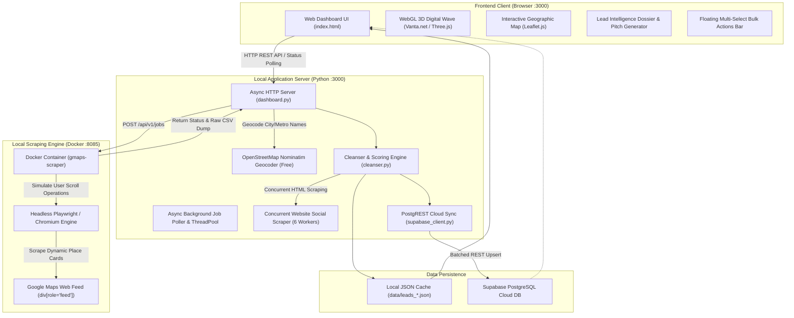

# 🗺️ LeadMap Pro — System Architecture & Comprehensive Technical Report

> **Project Name:** LeadMap Pro (Google Maps B2B Lead Extraction & Intelligence Suite)  
> **Repository:** `vighneshpote55-svg/B2B-Scraper`  
> **Documentation Generated:** October 2026  
> **License:** MIT  

---

## 📑 Table of Contents
1. [Executive Summary](#-executive-summary)
2. [End-to-End System Architecture](#-end-to-end-system-architecture)
3. [Deep Dive: Why "Scroll Depth" is Used](#-deep-dive-why-scroll-depth-is-used)
4. [Lead Quality Scorer (0–100) & Tiering Engine](#-lead-quality-scorer-0100--tiering-engine)
5. [API Keys & Zero-Cost Architecture](#-api-keys--zero-cost-architecture)
6. [Exhaustive File-by-File Breakdown](#-exhaustive-file-by-file-breakdown)
   - [Core Application Server & Orchestration](#1-core-application-server--orchestration)
   - [Processing & Automation Scripts (`scripts/`)](#2-processing--automation-scripts-scripts)
   - [Frontend Dashboard Application (`web/`)](#3-frontend-dashboard-application-web)
   - [Database, Storage & Examples](#4-database-storage--examples)
7. [Summary Table of All Project Files](#-summary-table-of-all-project-files)
8. [Quick-Start & Operational Commands](#-quick-start--operational-commands)

---

## ⚡ Executive Summary

**LeadMap Pro** is a fully self-hosted, enterprise-ready B2B lead generation and intelligence platform that extracts verified local business data directly from **Google Maps**.

### Core Value Propositions
- **Zero Paid APIs & Zero Recurring Subscriptions:** Eliminates expensive third-party scrapers (Apify, Outscraper) and avoids official Google Places API fees ($17–$32 per 1,000 queries).
- **Zero LLM Token Costs:** Deduplication, email cleansing, phone formatting, lead scoring, social media enrichment, and outreach pitch generation are executed via deterministic Python and JavaScript algorithms—requiring **0 OpenAI, Claude, or Gemini API tokens**.
- **Outreach-Ready Intelligence:** Cleans junk/bot emails, formats local & international phone numbers, computes a 0–100 lead score (HOT 🔥 / WARM ⚡ / COLD ❄️), extracts social handles (Instagram, Facebook, LinkedIn), and generates 1-click WhatsApp and Cold Email pitches.
- **Dual-Storage Engine:** Saves jobs locally as structured JSON/CSV files, with optional automated real-time synchronization to a PostgreSQL database on **Supabase Cloud**.

---

## 🏗️ End-to-End System Architecture



---

## 🎚️ Deep Dive: Why "Scroll Depth" is Used

In LeadMap Pro, **`depth` (Scroll Depth)** is a primary configuration parameter. Understanding its function requires analyzing how Google Maps renders results.

### 1. The Virtualized Infinite Scroll Problem
Google Maps **does not use traditional pagination** (e.g. `page=1`, `page=2`). Instead:
- When a search is performed, Google Maps renders a single scrollable container assigned the ARIA role `feed` (`div[role="feed"]`).
- In this initial viewport, Google Maps loads only **5 to 7 place cards** into the Document Object Model (DOM).
- Google uses **DOM virtualization**: cards that scroll out of view are recycled or removed from memory, and subsequent listings are fetched on-the-fly via encrypted background XHR/Protobuf streams when the user scrolls down.

```
┌────────────────────────────────────────────────────────┐
│  Google Maps Sidebar: div[role="feed"]                 │
│                                                        │
│  [ Card 1: Mile High Dental     ]  <-- In Viewport     │
│  [ Card 2: Downtown Smiles      ]  <-- In Viewport     │
│  [ Card 3: Apex Orthodontics    ]  <-- In Viewport     │
│  [ Card 4: Cherry Creek Teeth   ]  <-- In Viewport     │
│  [ Card 5: Summit Dental Care   ]  <-- In Viewport     │
├╌╌╌╌╌╌╌╌╌╌╌╌╌╌╌╌╌╌╌╌╌╌╌╌╌╌╌╌╌╌╌╌╌╌╌╌╌╌╌╌╌╌╌╌╌╌╌╌╌╌╌╌╌╌┤  <-- Viewport Cutoff
│  (Unrendered listings; loaded ONLY when container      │
│   scroll event fires and debounces)                    │
└────────────────────────────────────────────────────────┘
```

### 2. How the Headless Scraper Automates Scrolling
The scraping engine (`gosom/google-maps-scraper`) uses Playwright/Chromium to automate user interactions:
1. Chromium navigates to Google Maps with the targeted geographic coordinates (`lat`, `lon`, `zoom=15`).
2. It locates the scrollable feed element: `div[role="feed"]`.
3. It dispatches a programmatic scroll down by the viewport height: `element.scrollBy(0, viewportHeight)`.
4. It pauses to allow network debounce and wait for the loading spinner to resolve.
5. It inspects whether new place cards have entered the DOM and extracts their metadata.
6. **Each scroll step down the container represents 1 unit of `depth`.**

### 3. Scroll Depth vs. Yield vs. Latency Matrix

| Scroll Depth | Average Leads Yield | Scrape Time (No Email) | Scrape Time (With Email) | Recommended Use Case |
| :---: | :---: | :---: | :---: | :--- |
| **1 – 3** | ~5 – 15 leads | 8 – 12 seconds | 15 – 25 seconds | Fast testing, location verification, immediate top 10 lookups. |
| **5 (Default)** | **~20 – 25 leads** | **20 – 30 seconds** | **35 – 55 seconds** | **Optimal sweet spot.** Balances speed, volume, and stealth. |
| **10** | ~40 – 50 leads | ~50 – 70 seconds | ~1.5 – 2.5 minutes | Targeted outbound sales campaigns. |
| **15 – 20 (Max)** | ~80 – 120+ leads | ~2 – 3 minutes | ~4 – 6 minutes | Bulk CRM seeding, market mapping. Requires proxies for safety. |

### 4. Why Not Run at Depth 20 Every Time?
- **Google Rate-Limiting / IP Blocks:** Rapidly scrolling feeds triggers Google’s anti-bot heuristics. Running multiple depth 15–20 jobs back-to-back from a single residential IP can result in temporary blocks (HTTP 429 or empty search feeds) lasting 15–60 minutes.
- **Geographic Drift:** At depth 15–20, exact matches near the target coordinates become exhausted, and Google begins suggesting businesses located significantly further from the target center.
- **Email Latency:** Extracting verified emails requires visiting each business’s website. At depth 20 (100+ businesses), visiting 100 websites sequentially or concurrently takes several minutes.

---

## 🎯 Lead Quality Scorer (0–100) & Tiering Engine

Implemented in [`scripts/cleanser.py`](file:///home/vighnesh/Documents/B2B/scripts/cleanser.py#L175-L253), the scoring engine evaluates every prospect on a **0 to 100-point scale**.

### Points Distribution (Max: 100 Points)

| Factor | Points | Rationale | Code Implementation Criteria |
| :--- | :---: | :--- | :--- |
| ✉️ **Verified Email** | **+35 pts** | Highest priority for automated cold outreach & marketing sequences. | Valid email present after junk/bot filtering |
| 📞 **Verified Phone** | **+25 pts** | Enables cold calling and 1-click direct WhatsApp messaging. | Clean, standardized phone number present |
| 🌐 **Active Website** | **+20 pts** | Indicates an active, verified commercial enterprise. | Valid URL with extractable root domain |
| ⭐ **Star Rating** | **+10 pts** (or +5) | High customer satisfaction boosts social proof in pitches. | Rating $\ge 4.5\bigstar$ (+10 pts) or $\ge 4.0\bigstar$ (+5 pts) |
| 💬 **Review Volume** | **+5 pts** | Established business with active customer traffic. | Review count $\ge 20$ reviews |
| 📸 **Social Channels** | **+5 pts** | Multi-channel presence (Instagram, Facebook, or LinkedIn). | At least one social profile detected |

### Tier Classifications

```
  ┌───────────────────────────────┐
  │   0 pts                       │
  │     │                         │
  │     ▼                         │
  │   [ COLD ❄️ ]  Score < 40     │ ──> Incomplete data (e.g. address only, no site/reviews)
  │     │                         │
  │     ▼                         │
  │   [ WARM ⚡ ]  Score 40 - 69  │ ──> Partial info (e.g. Phone + Website, but no email)
  │     │                         │
  │     ▼                         │
  │   [ HOT 🔥 ]   Score ≥ 70     │ ──> Complete contact stack (Email + Phone + Site + High Rating)
  │     │                         │
  │   100 pts                     │
  └───────────────────────────────┘
```

- **🔥 HOT LEADS (`Score ≥ 70`):** Full contact profile (Email, Phone, Website, High Rating). Ready for immediate multi-touch outbound campaigns.
- **⚡ WARM LEADS (`Score 40 – 69`):** Strong prospect with partial contact info (e.g., Phone + Website, but missing email). Well-suited for phone calls or WhatsApp messages.
- **❄️ COLD LEADS (`Score < 40`):** Incomplete listing (e.g. physical address only, no website, or low/no review history).

### Itemized Score Reasons
Every lead stores an array of reasons for its score (e.g., `["Email Available (+35)", "Phone Available (+25)", "Website Active (+20)", "Top Rated 4.8★ (+10)", "Established (42 reviews) (+5)"]`), which is displayed in the **Lead Intelligence Dossier Drawer**.

---

## 🔑 API Keys & Zero-Cost Architecture

LeadMap Pro is designed to operate with **$0 in API fees**:

| Service | Traditional Paid Alternative | LeadMap Pro Implementation | Cost |
| :--- | :--- | :--- | :---: |
| **Maps Scraping** | Google Places API ($17–$32 / 1k calls)<br>Apify ($49/mo) | Self-hosted Docker container with headless Chromium | **$0.00** |
| **Geocoding** | Google Geocoding API ($5 / 1k calls) | OpenStreetMap Nominatim (~1 req/sec policy) | **$0.00** |
| **Data Enrichment** | OpenAI / Gemini API ($2.50 / 1k calls) | Deterministic Python regex and DOM parsing | **$0.00** |
| **Social Scraping** | Proxycurl / PhantomBuster ($50–$100/mo) | Concurrent Python HTTP workers with header spoofing | **$0.00** |
| **Outreach Pitches** | ChatGPT / Claude API tokens | Dynamic client-side templating engine | **$0.00** |

### Environment Keys Supported in [`.env`](file:///home/vighnesh/Documents/B2B/.env)

1. **`SUPABASE_KEY` (Optional):**
   - **Type:** Supabase `anon` public key or `service_role` secret.
   - **Purpose:** Synchronizes cleansed leads with your Supabase PostgreSQL cloud database. If omitted, leads are stored in local JSON files inside [`data/`](file:///home/vighnesh/Documents/B2B/data/).
2. **`SCRAPER_API_KEY` (Optional):**
   - **Type:** Custom secret header (`X-API-Key`).
   - **Purpose:** Only required if you deploy the Docker scraper container on a public remote host behind an authenticating reverse proxy.

---

## 📂 Exhaustive File-by-File Breakdown

### 1. Core Application Server & Orchestration

#### [`dashboard.py`](file:///home/vighnesh/Documents/B2B/dashboard.py)
- **Role:** Primary backend server, async job queue manager, and REST API provider.
- **Key Modules:** Python Standard Library (`http.server`, `urllib.request`, `threading`, `socketserver`, `json`, `csv`, `re`). Zero external dependencies.
- **Port:** Defaults to `3000` (configurable via `DASHBOARD_PORT`).
- **Core Operations:**
  1. **Static File Serving:** Delivers the web application from [`web/`](file:///home/vighnesh/Documents/B2B/web) (`index.html`, `app.css`, `app.js`, Leaflet, and Vanta assets).
  2. **Scraper Proxy & Health Check:** Connects to the local scraper container on `http://localhost:8085` to monitor container health and manage jobs.
  3. **Geocoding Engine:** Queries OpenStreetMap Nominatim to resolve place/city queries into latitude/longitude pairs.
  4. **Background Async Worker (`background_job_processor`):** Polls active jobs in a separate thread, downloads the raw CSV upon completion, triggers lead cleansing, scoring, and social enrichment, caches results in [`data/`](file:///home/vighnesh/Documents/B2B/data/), and triggers Supabase auto-sync.
  5. **REST API Routes:**
     - `GET /api/status`: Returns container and server health status.
     - `GET /api/jobs`: Lists historical and active extraction jobs.
     - `GET /api/job/<id>/status`: Returns real-time telemetry (progress %, elapsed time, pipeline stage).
     - `GET /api/job/<id>/leads`: Retrieves lead records for a specific job.
     - `GET /api/export`: Exports data as Clean CSV, Outreach/CRM CSV (for HubSpot, Instantly, Smartlead), or JSON.
     - `POST /api/scrape/start`: Initiates a new extraction job.
     - `POST /api/scrape/stop`: Cancels an in-progress scrape job.
     - `POST /api/supabase/*`: Endpoints for testing, configuring, syncing, and disconnecting Supabase Cloud integration.

#### [`run_dashboard.sh`](file:///home/vighnesh/Documents/B2B/run_dashboard.sh)
- **Role:** Production shell launcher.
- **Working:** Checks `docker ps` for the `gmaps-scraper` container; if inactive, launches `docker compose up -d`, pauses 4 seconds for container initialization, and starts `dashboard.py`.

#### [`docker-compose.yml`](file:///home/vighnesh/Documents/B2B/docker-compose.yml)
- **Role:** Container configuration for `gosom/google-maps-scraper:v1.18.1`.
- **Working:**
  - Binds internal port `8080` strictly to `127.0.0.1:8085` (ensuring the unauthenticated scraper API is not exposed publicly).
  - Configures runtime arguments: `["-web", "-data-folder", "/gmapsdata", "-exit-on-inactivity", "15m", "-c", "4"]`.
  - Persists scrape output to volume `gmaps_data` and browser binaries to `gmaps_cache`.

#### [`.env`](file:///home/vighnesh/Documents/B2B/.env) & [`.env.example`](file:///home/vighnesh/Documents/B2B/.env.example)
- **Role:** Configuration file defining `SCRAPER_PORT=8085`, `SCRAPER_BASE_URL=http://localhost:8085`, `SUPABASE_URL`, `SUPABASE_KEY`, `SUPABASE_TABLE=leads`, and `SUPABASE_AUTO_SYNC=true`.

#### [`package.json`](file:///home/vighnesh/Documents/B2B/package.json) & [`package-lock.json`](file:///home/vighnesh/Documents/B2B/package-lock.json)
- **Role:** Root Node.js manifest configuring `"scripts": {"dev": "python3 dashboard.py", "start": "python3 dashboard.py", "dashboard": "./run_dashboard.sh"}` and managing vendor packages (`animejs`, `three`, `vanta`, `puppeteer-core`).

#### [`supabase_schema.sql`](file:///home/vighnesh/Documents/B2B/supabase_schema.sql)
- **Role:** PostgreSQL DDL for Supabase.
- **Working:**
  - Creates the `public.leads` table with typed columns (`UUID id`, `title`, `clean_phone`, `emails`, `website`, `domain`, `lead_score`, `lead_tier`, `score_reasons`, `socials`, `raw_data JSONB`).
  - Sets up a composite partial unique index on `(clean_phone, domain)` for idempotent upserts.
  - Adds indices on `lead_tier`, `lead_score DESC`, and `created_at DESC`.
  - Creates a trigger function to automatically update `updated_at`.
  - Enables Row Level Security (RLS) with permissive read/write policies for local sync.

---

### 2. Processing & Automation Scripts (`scripts/`)

#### [`scripts/cleanser.py`](file:///home/vighnesh/Documents/B2B/scripts/cleanser.py)
- **Role:** Data hygiene, normalization, scoring, and social enrichment engine.
- **Key Functions:**
  - `clean_emails()`: Filters out asset extensions (`.png`, `.svg`), placeholder addresses (`user@domain.com`), and bot/sentry emails (`sentry@wix.com`, `noreply@`), sorting domain-matching addresses first.
  - `clean_phone()`: Normalizes digits into standard international formats (`+91 XXXXX XXXXX` for India, `+1 (XXX) XXX-XXXX` for North America).
  - `clean_social_url()`: Removes tracking parameters (`?igshid=`, `?ref=`) from social URLs.
  - `deduplicate_leads()`: Deduplicates listings within a single extraction batch.
  - `load_historical_leads()` & `filter_previously_seen_leads()`: Cross-job incremental deduplication engine. Automatically cross-references incoming scrape listings against past data archives (`data/leads_*.json`) matching Google Place ID, Google CID, verified phone numbers, root domains, and normalized title+address to ensure previously scraped businesses are not repeated and only newly discovered leads are saved.
  - `enrich_socials()`: Uses a `ThreadPoolExecutor` (6 workers) to fetch business homepages with an 8-second timeout, extracting Instagram, Facebook, and LinkedIn links via regex.

#### [`scripts/scrape.py`](file:///home/vighnesh/Documents/B2B/scripts/scrape.py)
- **Role:** Standalone CLI tool for headless scraping without opening a browser.
- **Features:** Auto-geocodes locations via `--city`, handles batch keyword files via `--keywords-file`, filters output fields, triggers lead scoring, and auto-syncs results to Supabase if configured in `.env`.

#### [`scripts/scrape.sh`](file:///home/vighnesh/Documents/B2B/scripts/scrape.sh)
- **Role:** Minimal POSIX shell script wrapping `curl` calls to trigger a job, poll until complete, download the CSV, and trim output to core lead columns.

#### [`scripts/supabase_client.py`](file:///home/vighnesh/Documents/B2B/scripts/supabase_client.py)
- **Role:** Pure standard-library PostgREST client for interacting with Supabase.
- **Features:** Validates project credentials, formats lead fields to match the SQL schema, generates deterministic UUIDv5 identifiers from `phone|domain` to prevent duplicates, and executes batch upserts using `Prefer: resolution=merge-duplicates`.

#### [`scripts/verify_features.js`](file:///home/vighnesh/Documents/B2B/scripts/verify_features.js)
- **Role:** End-to-end automated UI test suite using Puppeteer.
- **Features:** Launches headless Chrome, navigates to `http://localhost:3000`, and verifies the Dossier drawer, outreach pitch generator tabs, bulk action multi-select, and Leaflet map view with screenshot artifacts.

---

### 3. Frontend Dashboard Application (`web/`)

#### [`web/index.html`](file:///home/vighnesh/Documents/B2B/web/index.html)
- **Role:** Single-page dashboard interface.
- **Key Components:**
  - Header with scraper status indicators, Supabase connection status, theme toggle, and history drawer toggle.
  - Infinite marquee feature banner.
  - Extraction form card with search niche, city, preset chips, and the scroll depth slider (1–20).
  - Live telemetry progress box with step indicators, elapsed timer, and cancel button.
  - KPI metric grid displaying Total, Hot, Email, and Phone lead counts.
  - Filter tabs (`All`, `🔥 Hot`, `⚡ Warm`, `✉️ Has Email`) and view switcher (Table vs. Map View).
  - Slide-over **Lead Intelligence Dossier Drawer** with business details and outreach pitch generator.
  - Floating **Multi-Select Bulk Actions Bar** for batch email/phone copying, cloud sync, and CSV export.
  - Supabase Cloud Configuration Modal.

#### [`web/app.js`](file:///home/vighnesh/Documents/B2B/web/app.js)
- **Role:** Client-side application controller.
- **Key Modules:**
  - State management for active leads, filters, search queries, sort orders, and selection sets.
  - `startScrape()` & `pollJobStatus()`: Manages real-time job execution and telemetry polling.
  - `renderLeadsTable()`: Dynamically builds the data table with lead tier badges and action buttons.
  - `initLeafletMap()` & `updateMapPins()`: Renders interactive map pins color-coded by tier (🔥 Red, ⚡ Amber, ❄️ Blue).
  - `openDossier()` & `generateOutreachPitch()`: Generates personalized WhatsApp and Cold Email pitches using business metadata.
  - `handleBulkActions()`: Manages batch clipboard operations, exports, and cloud sync.

#### [`web/app.css`](file:///home/vighnesh/Documents/B2B/web/app.css)
- **Role:** Complete design system and stylesheet.
- **Features:** Glassmorphism styling (`backdrop-filter: blur(12px)`), dark/light theme CSS variables, responsive mobile adjustments, custom scrollbars, and keyframe animations for marquee tickers and data pipelines.

#### [`web/package.json`](file:///home/vighnesh/Documents/B2B/web/package.json)
- **Role:** Convenience npm manifest mapping `npm run dev` and `npm start` directly to `python3 ../dashboard.py`.

#### Vendor Client Libraries:
- **[`web/leaflet.js`](file:///home/vighnesh/Documents/B2B/web/leaflet.js) & [`web/leaflet.css`](file:///home/vighnesh/Documents/B2B/web/leaflet.css):** Open-source interactive map engine using OpenStreetMap tiles.
- **[`web/anime.min.js`](file:///home/vighnesh/Documents/B2B/web/anime.min.js):** Animation library powering micro-interactions and counter transitions.
- **[`web/three.r134.min.js`](file:///home/vighnesh/Documents/B2B/web/three.r134.min.js) & [`web/vanta.net.min.js`](file:///home/vighnesh/Documents/B2B/web/vanta.net.min.js):** WebGL 3D dynamic mesh background.

---

### 4. Database, Storage & Examples

#### [`data/`](file:///home/vighnesh/Documents/B2B/data/)
- **Role:** Local JSON datastore holding archived extraction runs (`leads_<job_id>.json`).

#### [`examples/`](file:///home/vighnesh/Documents/B2B/examples/)
- **[`queries.example.txt`](file:///home/vighnesh/Documents/B2B/examples/queries.example.txt):** Sample batch keyword file for multi-query extractions.
- **[`queries.example.json`](file:///home/vighnesh/Documents/B2B/examples/queries.example.json):** Sample API request payload schema including coordinate reference data for major metropolitan areas.

#### [`.claude/`](file:///home/vighnesh/Documents/B2B/.claude/)
- **Role:** Configuration directory for Claude Code agent interactions.
- Contains pre-approved commands (`/scrape`, `/scrape-batch`, `/scrape-setup`, `/scrape-jobs`) and the comprehensive skill guide in [`.claude/skills/google-maps-scraper/SKILL.md`](file:///home/vighnesh/Documents/B2B/.claude/skills/google-maps-scraper/SKILL.md).

---

## 📊 Summary Table of All Project Files

| File Path | Language / Format | Role & Purpose |
| :--- | :---: | :--- |
| [`dashboard.py`](file:///home/vighnesh/Documents/B2B/dashboard.py) | Python 3 | Main HTTP web server, REST API, Nominatim geocoder, async worker. |
| [`run_dashboard.sh`](file:///home/vighnesh/Documents/B2B/run_dashboard.sh) | Bash | Health check script for Docker and launcher for dashboard.py. |
| [`docker-compose.yml`](file:///home/vighnesh/Documents/B2B/docker-compose.yml) | YAML | Multi-container specification for `gosom/google-maps-scraper`. |
| [`.env`](file:///home/vighnesh/Documents/B2B/.env) | Configuration | Ports, scraper endpoint, and Supabase cloud credentials. |
| [`package.json`](file:///home/vighnesh/Documents/B2B/package.json) | JSON | Root npm scripts for running the dashboard. |
| [`supabase_schema.sql`](file:///home/vighnesh/Documents/B2B/supabase_schema.sql) | SQL | PostgreSQL schema, deduplication indices, RLS policies. |
| [`scripts/cleanser.py`](file:///home/vighnesh/Documents/B2B/scripts/cleanser.py) | Python 3 | Email cleaner, phone normalizer, lead scorer (0-100), social extractor. |
| [`scripts/scrape.py`](file:///home/vighnesh/Documents/B2B/scripts/scrape.py) | Python 3 | Standalone CLI scraper runner with geocoding, scoring, and cloud sync. |
| [`scripts/scrape.sh`](file:///home/vighnesh/Documents/B2B/scripts/scrape.sh) | Bash | Fast curl-based scraper command-line wrapper. |
| [`scripts/supabase_client.py`](file:///home/vighnesh/Documents/B2B/scripts/supabase_client.py) | Python 3 | PostgREST client for schema casting, verification, and batch upserts. |
| [`scripts/verify_features.js`](file:///home/vighnesh/Documents/B2B/scripts/verify_features.js) | JavaScript | Puppeteer automated browser test suite for visual verification. |
| [`web/index.html`](file:///home/vighnesh/Documents/B2B/web/index.html) | HTML5 | Frontend markup, form controls, dossier drawer, and modal dialogs. |
| [`web/app.js`](file:///home/vighnesh/Documents/B2B/web/app.js) | JavaScript | Client state management, polling loop, Leaflet map, outreach pitches. |
| [`web/app.css`](file:///home/vighnesh/Documents/B2B/web/app.css) | CSS3 | Custom property design system, glassmorphism, dark/light themes. |
| [`web/package.json`](file:///home/vighnesh/Documents/B2B/web/package.json) | JSON | Subdirectory npm scripts routing to `dashboard.py`. |
| [`web/leaflet.js`](file:///home/vighnesh/Documents/B2B/web/leaflet.js) / [`.css`](file:///home/vighnesh/Documents/B2B/web/leaflet.css) | JS / CSS | Interactive map rendering engine and stylesheet. |
| [`web/anime.min.js`](file:///home/vighnesh/Documents/B2B/web/anime.min.js) | JavaScript | Micro-interaction and UI counter animation library. |
| [`web/three.r134.min.js`](file:///home/vighnesh/Documents/B2B/web/three.r134.min.js) | JavaScript | WebGL 3D graphics library. |
| [`web/vanta.net.min.js`](file:///home/vighnesh/Documents/B2B/web/vanta.net.min.js) | JavaScript | WebGL 3D dynamic network mesh animation. |
| [`data/`](file:///home/vighnesh/Documents/B2B/data/) | Directory / JSON | Local storage for archived scrape job results. |
| [`examples/`](file:///home/vighnesh/Documents/B2B/examples/) | Text / JSON | Sample query files and metropolitan coordinate cheatsheets. |
| [`.claude/`](file:///home/vighnesh/Documents/B2B/.claude/) | Markdown / JSON | Claude Code automated scraping commands and skill definitions. |

---

## 🚀 Quick-Start & Operational Commands

### 1. Launching the Web Application
```bash
# Option A: Using npm (from root or web/ directory)
npm run dev

# Option B: Using the launcher script
./run_dashboard.sh

# Option C: Direct Python invocation
python3 dashboard.py
```
Access the dashboard in your browser: **`http://localhost:3000`**

### 2. Running Headless CLI Extractions
```bash
# Extract 20 dentists with auto-geocoding, email cleansing, and lead scoring
python3 scripts/scrape.py --query "Dentists in Austin TX" --depth 5 --email --socials

# Batch extraction using a query file
python3 scripts/scrape.py --keywords-file examples/queries.example.txt --city "Denver, CO"

# Output directly to structured JSON
python3 scripts/scrape.py --query "Cafes in Miami FL" --depth 3 --json --out cafes.json
```

### 3. Docker Maintenance
```bash
# Verify container status
docker ps | grep gmaps-scraper

# Restart the scraper service
docker compose restart

# View scraper logs
docker logs -f gmaps-scraper
```
